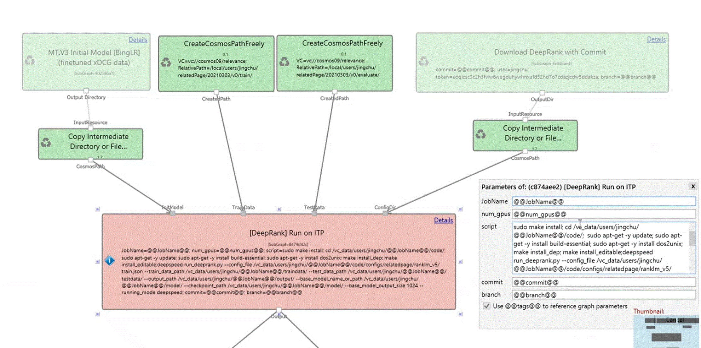
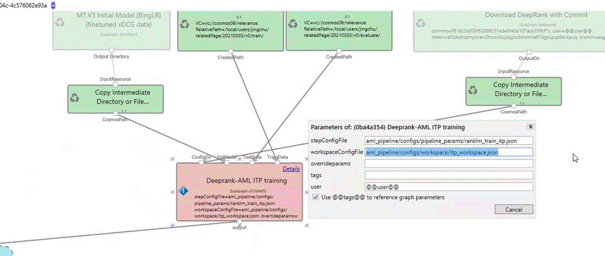
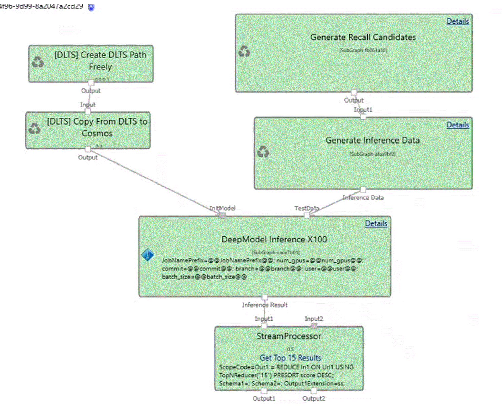
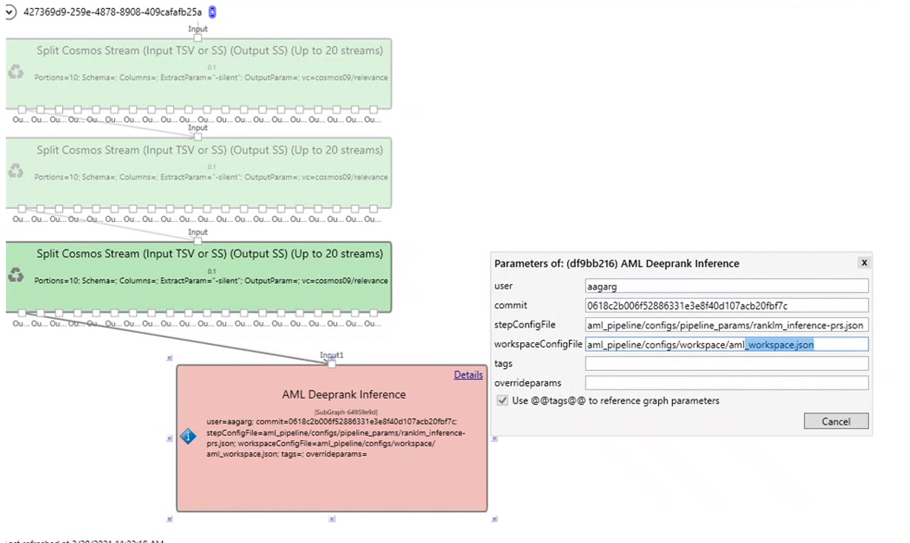

# Introduction
- This directory contains the documentation and configuration files needed to help oboard your Deeprank model to AML. 
 
# Getting Started

- ## Permissions/SG needed to join
     Get your SG added to 
     1. AML resource group [bing-cr-prd](https://ms.portal.azure.com/#@72f988bf-86f1-41af-91ab-2d7cd011db47/resource/subscriptions/6560575d-fa06-4e7d-95fb-f962e74efd7a/resourceGroups/bing-cr-prd/overview)  
       - (Skip if you're already a part of modelfunteam@microsoft.com or aml-ds@microsoft.com)
     2. AML Workspace [bing-cr-aml-prd](https://ms.portal.azure.com/#@72f988bf-86f1-41af-91ab-2d7cd011db47/resource/subscriptions/6560575d-fa06-4e7d-95fb-f962e74efd7a/resourceGroups/bing-cr-prd/providers/Microsoft.MachineLearningServices/workspaces/bing-cr-aml-prd/overview).
       - (Skip if you're already a part of modelfunteam@microsoft.com or aml-ds@microsoft.com)
     3. Relevance ADLS group [relevance-c09_RWX](https://ms.portal.azure.com/#blade/Microsoft_AAD_IAM/GroupDetailsMenuBlade/Overview/groupId/eb2a3428-71c0-4751-9194-715007f36d74)
       - (Skip if you're already a part of aml-ds@microsoft.com or relevance-users@microsoft.com)

## Two approaches to submit jobs to AML
1. Using a Jupyter notebook
2. Using Aether module

### Using the Jupyter notebook to submit runs to AML
Start exploring this [Notebook](https://msasg.visualstudio.com/Bing_and_IPG/_git/deeprank?path=%2Fdeeprank%2Fpagerec.ipynb&version=GBaagarg%2Franklm&_a=preview&anchor=getting-started) to submit AML pipelines.

## Using Aether to submit runs to AML/ITP 
### Training
In Aether, by replacing your ITP training subgraph with only one Deeprank AML ITP training module, you can continue to submit to ITP cluster and/or AML compute
and get all the added benefits of AML. 

**Current Training Module submitted to ITP**

**AML Deeprank Training Module**
- The Deeprank AML ITP module takes only two parameters **stepConfigFile** and the **workspaceConfigFile** which submits to AML.
- You can edit the **overrideparams** parameter to overwride any parameters instead of editing these parameters in the config file. You can add parameters
as dictionary values for example {batch_size: 10}. 
- You can also add run tags in the **tags** parameter.  

**Benefits:**
*	Improved experiment tracking 
*	Automated hyperparameter tuning
*	Increased resource utilization (AML Compute + existing ITP compute)
*	Replace long commands with configs and overridable params

### Inferencing 
In Aether, by replacing your Inferencing subgraph with only one Deeprank AML ITP inferencing module, you can continue to submit to ITP cluster and/or AML compute
and get all the added benefits of AML. 

**AML Deeprank PRS Module**
- The Deeprank AML PRS module takes only two parameters **stepConfigFile** and the **workspaceConfigFile** which submits to AML.
- You can edit the **overrideparams** parameter to overwride any parameters instead of editing these parameters in the config file. You can add parameters
as dictionary values for example {batch_size: 10}. 
- You can also add run tags in the **tags** parameter.  

**Configurable Parallelization**
- There is also configurable parallelization where you can specify the number of **numNodes** and **numGPUs** which can save 100x graph complexity. 

**Benefits:**
*	Increased resource utilization (AML Compute+existing ITP)
*	Automatic retries and non-redundant code/modules for batch inferencing
*	Aether graph for inferencing simplified by 100x

## AML Scenarios Supported 

* Scope
* Regular training
* Distributed training
* PRS 
* Hyperparameter optimization

Hyperparameter tuning, also called hyperparameter optimization, is the process of finding the configuration of hyperparameters that results in the best performance. The process is typically computationally expensive and manual. Use this [notebook](https://msasg.visualstudio.com/Bing_and_IPG/_git/deeprank?path=%2Fdeeprank%2Fpagerec.ipynb&_a=preview) to walkthrough how to set up your resources and to learn how to submit an AML Pipeline using the sweep component. The **Hyperparameter Optimization** section of the notebook covers how to configure and submit a pipeline sweep job. See [here](https://componentsdk.azurewebsites.net/components/sweep_component.html) for more details on the Sweep component. 

Use the configuration file [sweep.json](https://msasg.visualstudio.com/Bing_and_IPG/_git/deeprank?path=%2Fdeeprank%2Faml_pipeline%2Fconfigs%2Fpipeline_params%2Fsweep.json) to edit the parameters and settings for your job. This file outlines how you can do the following tasks.  

  * Define the parameter search space. In this example, we are tuning on **batch_size_per_gpu** and **learning_rate**. 
  * Specify a primary metric to optimize. In this example, we are optimizing the metric **onedcg_3**. 
  * Specify early termination policy for low-performing runs
  * Create and assign resources
  * Launch an experiment with the defined configuration
  * Visualize the training runs
  * Select the best configuration for your model

#### Visualize hyperparameter tuning runs
4. After you submit your training job, you can visualize your hyperparameter tuning runs in the [Azure Machine Learning studio UI](ml.azure.com),
or you can use a [notebook widget](https://docs.microsoft.com/en-us/azure/machine-learning/how-to-tune-hyperparameters#notebook-widget).
5. In the **Experiments** tab, if you submitted a pipeline run, select the run and then select the **Steps** tab. 
6. Navigate to the **Child runs** tab to view each hyperdrive child run. This visualization tracks the metrics logged for each hyperdrive child run over 
  the duration of hyperparameter tuning. Each line represents a child run, and each point measures the primary metric value at that iteration of runtime. 
  

# Additional Information

### How to do interactive debugging
[Coming soon]
### How to view metrics dashboard
[Coming soon]

### Contacts
Contact Aashna Garg (aagarg@microsoft.com), Shané Winner (shwinne@microsoft.com) for any questions/feedback.

Contacts for respective teams issues with: 

ADLS issues:
ComponentSDK issues:
Sweep issues:
PRS issues:

### Resources 
[Sweep Component](https://componentsdk.azurewebsites.net/components/sweep_component.html)

