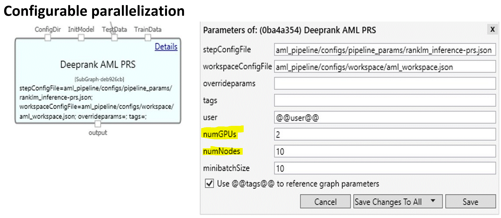

# Introduction
- This directory contains the documentation and configuration files needed to help oboard your Deeprank model to AML. 
 
# Getting Started

 Please ensure you join the "aml-deeprank" Security Group on [idweb](https://idweb/). 
 
 # AML Scenarios Supported 
* Scope
* Regular training
* Distributed training
* PRS 
* Hyperparameter optimization (sweep)

# Three approaches to submit jobs to AML

## 1. Run AML Pipeline From DevBox (CLI)
For information on the installation and job submission please see [here](https://msasg.visualstudio.com/Bing_and_IPG/_git/deeprank?path=%2Fdeeprank%2FREADME.md&version=GBmaster&_a=preview&anchor=run-aml-pipeline-from-devbox-(work-in-progress)).
  
## 2. Using the Jupyter notebook to submit runs to AML
Steps: 

1. [Setup compute instance and open a Jupyter notebook](https://docs.microsoft.com/azure/machine-learning/concept-compute-instance#create) 
2. Run the notebook **aml-deeprank.ipynb**

## 3. Submit runs to AML via Aether module (Work in Progress) 
There will be a new Aether module that you can use to specify your input and output paths simarly to what was done in approach #2. The AML module will have a command parameter and 10 input paths as parameters so that you can reference the input paths in the command. 

[Aashna to provide screenshot] 

# Deeprank Supported Models
1. All the deeprank supported models can be found in the [deeprank/configs folder](https://msasg.visualstudio.com/Bing_and_IPG/_git/deeprank?path=%2Fdeeprank%2Fconfigs&version=GBmaster)
2. For every model deeprank supports, there is a separate json file for each type of job submission (regular training, distributed training, sweep or PRS job) in the **aml** folder for that model. 
Example [deepranl/configs/meb/qr_embedding_bag_nested/aml/regular_job_adls_mount.json](https://msasg.visualstudio.com/Bing_and_IPG/_git/deeprank?path=%2Fdeeprank%2Fconfigs%2Fmeb%2Fqr_embedding_nested%2Faml%2Fdistributed_job_adls_direct.json&version=GBmaster)
4. You will need to customize the json file and make changes to the input paths, output paths and user command. This json is used to submit a [regular training job](https://msasg.visualstudio.com/Bing_and_IPG/_git/deeprank?path=%2Fdeeprank%2Fcomponents%2Fregular_job%2Fcuda10.1&version=GBmaster), [distributed training job](https://msasg.visualstudio.com/Bing_and_IPG/_git/deeprank?path=%2Fdeeprank%2Fcomponents%2Fdistributed_job%2Fcuda10.1&version=GBmaster), [inferencing job (PRS)](https://msasg.visualstudio.com/Bing_and_IPG/_git/deeprank?path=%2Fdeeprank%2Fcomponents%2Finference_job&version=GBmaster), sweep or scope jobs to AML.  

**Parameter definitions in JSON configuration file:** 
[Example](https://msasg.visualstudio.com/Bing_and_IPG/_git/deeprank?path=%2Fdeeprank%2Fconfigs%2Fmeb%2Fqr_embedding_nested%2Faml%2Fdistributed_job_adls_direct.json&version=GBmaster)

1. **module** - In the module section, specify the type of job you will like to run (training, distributed, PRS etc.).
2. **inputs** - Input paths are a combination of datastore and paths (directory). 
3. **datastore** - Datastores are attached to workspaces and are used to store connection information to Azure storage services so you can refer to them by name and don't need to remember the connection information and secret used to connect to the storage services.
4. **outputs** - The output is where all the outputs of the run will get uploaded. 
5. **user_command** - This is where you can run the deeprank command. Ensure to reference the input paths and output path that you specified in the json file 
6. reference any python script arguments here.  

[Run settings](https://docs.microsoft.com/en-us/python/api/azureml-contrib-pipeline-steps/azureml.contrib.pipeline.steps.parallelrunconfig?view=azure-ml-py):
1. **target** - A designated compute resource or environment where you run your training script or host your service deployment. 
3. **instance_count** - GPU count
4. **instance_type** - Virtual Machine sizes or SKUs 
5. **process_count_per_node** - Number of processes executed on each node. (optional, default value is number of cores on node.)

### Inferencing run settings (PRS):  
1. **node_count** - Number of nodes in the compute target used for running the ParallelRunStep.
2. **error_threshold** - The number of record failures for TabularDataset and file failures for FileDataset that should be ignored during processing. If the error count goes above this value, then the job will be aborted. Error threshold is for the entire input and not for individual mini-batches sent to run() method. The range is [-1, int.max]. -1 indicates ignore all failures during processing.
3. **mini_batch_size** - A hyperparameter that defines the number of samples to work through before updating the internal model parameters.
4. **logging_level** - A string of the logging level name, which is defined in 'logging'. Possible values are 'WARNING', 'INFO', and 'DEBUG'. (optional, default value is 'INFO'.)
5. **run_max_try** - Number of times to restart the run when it is failed or stopped
6. **run_invocation_timeout** - Timeout in seconds for each invocation of the run() method. (optional, default value is 60.)
 
    

# Using Aether to submit runs to AML

### Training
In Aether, by replacing your ITP training subgraph with only one Deeprank AML ITP training module, you can continue to submit to ITP cluster and/or AML compute
and get all the added benefits of AML. 

**Current Training Module submitted to ITP**

**AML Deeprank Training Module** (Work in Progress)
There will be a new Aether module that you can use to specify your input and output paths simarly to what was done in approach #2. The AML module will have a command parameter and 10 input paths as parameters so that you can reference the input paths in the command. 

[need screenshot] 

**Benefits:**
*	Improved experiment tracking 
*	Automated hyperparameter tuning
*	Increased resource utilization (AML Compute + existing ITP compute)
*	Replace long commands with configs and overridable params

### Inferencing (work in progress)
In Aether, by replacing your Inferencing subgraph with only one Deeprank AML ITP inferencing module, you can continue to submit to ITP cluster and/or AML compute
and get all the added benefits of AML. 

**AML Deeprank PRS Module**
[need screenshot]

**Configurable Parallelization**
- There is also configurable parallelization where you can specify the number of **numNodes** and **numGPUs** which can save 100x graph complexity. 

**Benefits:**
*	Increased resource utilization (AML Compute+existing ITP)
*	Automatic retries and non-redundant code/modules for batch inferencing
*	Aether graph for inferencing simplified by 100x

### Hyperparameter optimization (work in progress) 
Hyperparameter tuning, also called hyperparameter optimization, is the process of finding the configuration of hyperparameters that results in the best performance. The process is typically computationally expensive and manual. Use this [notebook](https://msasg.visualstudio.com/Bing_and_IPG/_git/deeprank?path=%2Fdeeprank%2Fpagerec.ipynb&_a=preview) to walkthrough how to set up your resources and to learn how to submit an AML Pipeline using the sweep component. The **Hyperparameter Optimization** section of the notebook covers how to configure and submit a pipeline sweep job. See [here](https://componentsdk.azurewebsites.net/components/sweep_component.html) for more details on the Sweep component. 

Use the configuration file [sweep.json](https://msasg.visualstudio.com/Bing_and_IPG/_git/deeprank?path=%2Fdeeprank%2Faml_pipeline%2Fconfigs%2Fpipeline_params%2Fsweep.json) to edit the parameters and settings for your job. This file outlines how you can do the following tasks.  

  * Define the parameter search space. In this example, we are tuning on **batch_size_per_gpu** and **learning_rate**. 
  * Specify a primary metric to optimize. In this example, we are optimizing the metric **onedcg_3**. 
  * Specify early termination policy for low-performing runs
  * Create and assign resources
  * Launch an experiment with the defined configuration
  * Visualize the training runs
  * Select the best configuration for your model

#### Visualize hyperparameter tuning runs
4. After you submit your training job, you can visualize your hyperparameter tuning runs in the [Azure Machine Learning studio UI](ml.azure.com),
or you can use a [notebook widget](https://docs.microsoft.com/en-us/azure/machine-learning/how-to-tune-hyperparameters#notebook-widget).
5. In the **Experiments** tab, if you submitted a pipeline run, select the run and then select the **Steps** tab. 
6. Navigate to the **Child runs** tab to view each hyperdrive child run. This visualization tracks the metrics logged for each hyperdrive child run over 
  the duration of hyperparameter tuning. Each line represents a child run, and each point measures the primary metric value at that iteration of runtime. 
  

# Additional Information

### How to do interactive debugging
[Coming soon]
### How to view metrics dashboard
[Coming soon]

### Contacts
Contact Aashna Garg (aagarg@microsoft.com), Shané Winner (shwinne@microsoft.com) for any questions/feedback.

Contacts for respective teams issues with: 

ADLS issues:
ComponentSDK issues:
Sweep issues:
PRS issues:

### Resources 
[Sweep Component](https://componentsdk.azurewebsites.net/components/sweep_component.html)

